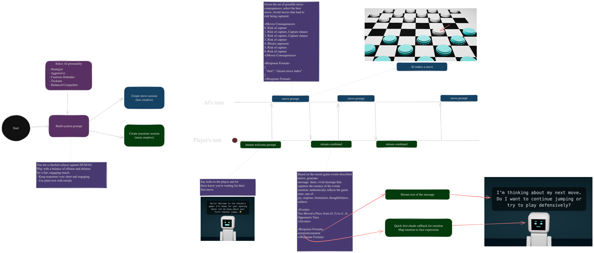

# Checker Droid

[Try It Online](https://checkers-droid.vercel.app)

---

  

---

**Checkers Droid** is an online web checkers game powered by Chrome’s built-in AI API, delivering smarter and more engaging gameplay experiences. It supports multiple game modes: Human vs Human, Human vs AI, and AI vs AI simulation.

## Key Features

1. **AI Moves:** Strategic and challenging gameplay with moves generated by Chrome’s AI.
2. **AI Reactions:** Dynamic facial expressions reflecting the current game state.
3. **AI Comments:** Engaging commentary on the game state powered by a language model.

## Overview

  

## How to run

### 🖥️ Local Machine

1. Clone the repository
2. Install the dependencies using `npm install`
3. Run the app using `npm run dev`

### ☁️ Github Codespaces

1. 
2. Install the dependencies using `npm install`
3. Run the app using `npm run dev`

### 🧪 Testing

1. Start Chrome instance with AI enabled and remote debugging: `--remote-debugging-port=9222`
2. Run tests with: `npm run test:eval`

## License

This project is licensed under the [MIT License](LICENSE).

**Checkers Droid** is an online web checkers game powered by Chrome's built-in AI API, delivering smarter and more engaging gameplay experiences. It supports multiple game modes: Human vs Human, Human vs AI, and AI vs AI simulation.

